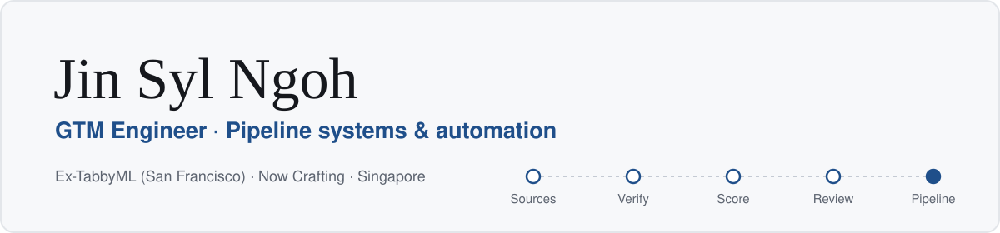
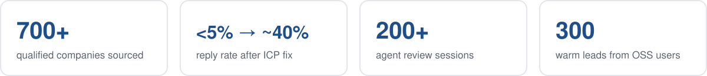
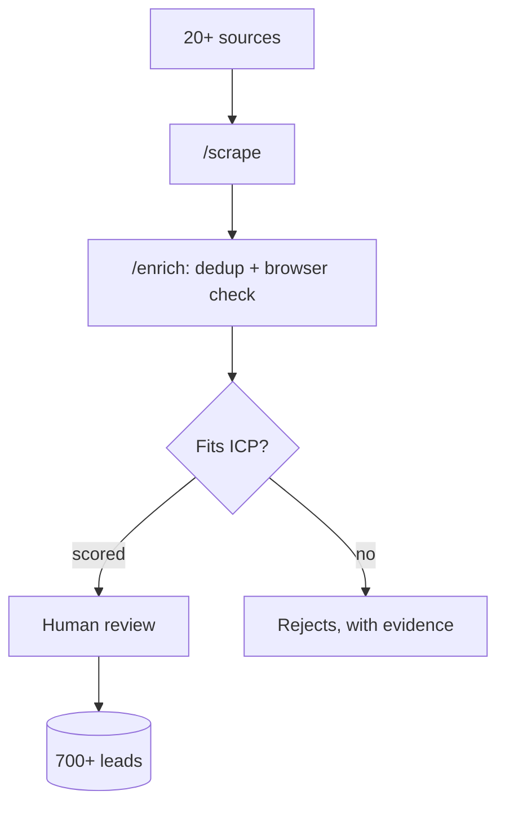
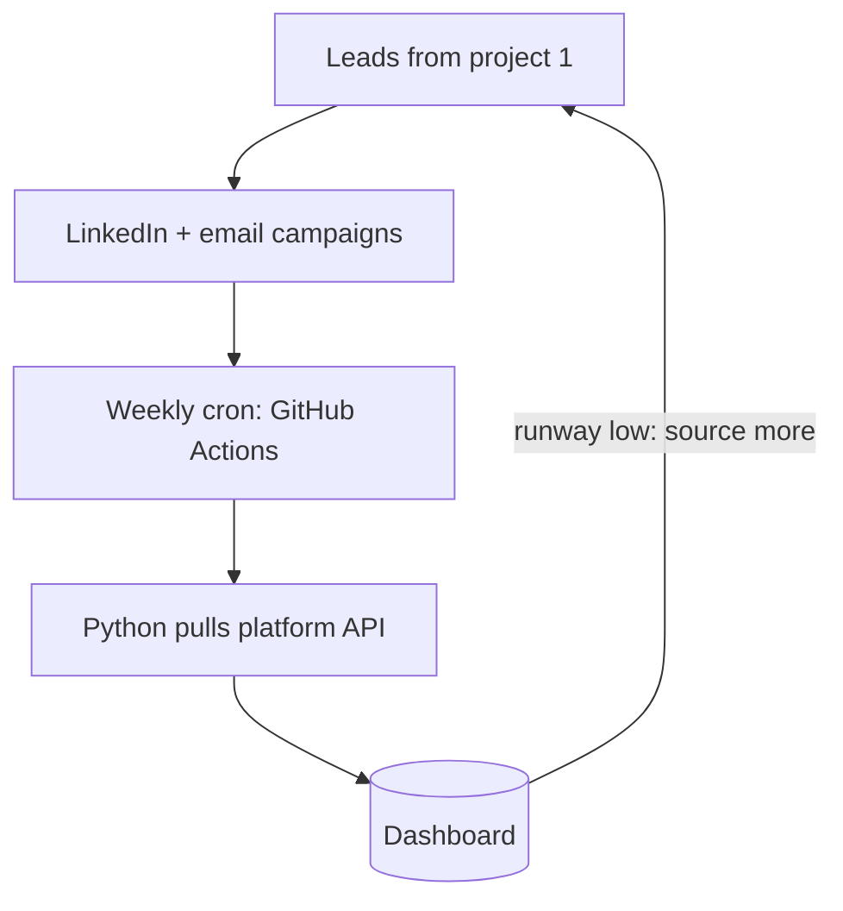

<picture>
  <source media="(prefers-color-scheme: dark)" srcset="assets/banner-dark.svg">
  
</picture>

I build the systems behind pipeline for AI and technical B2B products: agent-run lead sourcing, outbound tuned with data, and reporting that runs itself. 

Previously GTM Engineer at **[TabbyML](https://github.com/TabbyML/tabby)**, the team behind Pochi, an open-source AI coding agent. Now leading Singapore GTM for **Crafting**.

<picture>
  <source media="(prefers-color-scheme: dark)" srcset="assets/stats-dark.svg">
  
</picture>

### What I've built

| Project | What it does |
|---|---|
| [Lead-sourcing pipeline](#1-agentic-lead-sourcing-pipeline) | AI agents scrape startup lists, check each company in a browser, score it against the ICP |
| [Outreach dashboard](#2-outreach-health-dashboard) | Tracks the outreach campaigns run on those leads, pulled from the API every week |
| [Warm outbound engine](#3-warm-outbound-engine) | Outreach to the open-source user base, targeting tuned every cycle |
| [X engagement agent](#4-x-engagement-agent) | Agent drafts replies, a human approves them in a GitHub PR |

---

### 1. Agentic lead-sourcing pipeline

**The problem:** We needed a narrow, technical B2B segment that no off-the-shelf list covered. Hand-sourcing was slow and noisy.

**How it works:** three commands, each run by Claude Code agents:
- **`/scrape`** pulls raw company lists from 20+ public sources (accelerators, VC portfolios, market maps…)
- **`/enrich`** removes duplicates, then parallel agents open each company in a real browser, check its product and docs, and score it into tiers or reject it with evidence
- **`/merge`** adds the companies a human approved to the master list, with a snapshot to roll back to

**Judgment calls that mattered:**
- **I measured yield per source, and it changed the strategy.** Lists of *funded companies* converted far better than open-source *project* lists (the worst project list yielded just 3%), so I re-prioritised sources by data and dropped the ones that had run dry.
- **"Implied" doesn't count.** A company only passes on confirmed evidence, never on a guess from its tagline.
- **Every bug went into a pipeline log** along with its fix. That's how a human review gate became a hard rule.

**Example run:** ~1,900 raw companies → under 100 qualified, every top-tier lead verified in a browser.

Diagram

`Claude Code` · `Browser automation (MCP)` · `Python` · `Parallel agents`

---

### 2. Outreach health dashboard

**The problem:** The leads from project #1 went into LinkedIn and email campaigns, but the outreach platform's own dashboard didn't give reliable numbers. We couldn't tell which campaigns were working, or when we'd run out of leads.

**How it works:** a Python job pulls every campaign's data from the outreach platform's API → computes health metrics → writes a weekly snapshot to a shared dashboard. GitHub Actions runs it every week. It tracks connections, replies, interested leads and **lead runway** (leads imported − leads reached), which says when to source more.

**Judgment calls that mattered:**
- **Trust the API, not the UI.** I built straight off the API and documented the remaining data gaps honestly rather than hiding them.
- **Built to run unattended:** retry with backoff on rate limits, weekly writes that are safe to re-run (no double-counting), and a heartbeat commit so GitHub doesn't auto-disable the schedule.

Diagram

`Python` · `REST APIs` · `GitHub Actions`

---

<b>3. Warm outbound engine</b>: click to expand

**The problem:** The open-source project had community awareness but no path from it to qualified conversations.

**What I built:** 300 warm contacts mined from the open-source user base (developers who'd already used the product), email and LinkedIn sequences, and a reply playbook organised by lead intent so replies scale without deliberating each one.

**Judgment call that mattered:**
- **Fixed targeting before copy.** Low early replies looked like a messaging problem. The data said targeting: a big share of the list simply wasn't the right kind of company. Tightening the ICP took reply rate from **<5% to ~40%**, and LinkedIn open rate from **~40% to 60–70%**. That ICP lesson later became the core of project #1.

`Outbound` · `ICP design` · `Email + LinkedIn sequencing`

<b>4. X engagement agent</b>: click to expand

**The problem:** Engaging developers on X was manual, inconsistent, and dependent on one person.

**How it works:** an agent browses X, filters posts, drafts replies, and opens each session as a **GitHub PR**. A reviewer accepts or rejects each reply in the PR, and the decisions sync back into the agent's state.

**Judgment calls that mattered:**
- **Skip by default.** Hard filters (freshness, crowding, relevance, no over-engaging anyone), then a scoring rubric for what's left.
- **Quality gates before any reply.** The bar: would a senior engineer learn something concrete from it? Generic commentary gets skipped.
- **PRs as the review step.** That reused a tool the team already lived in, and every reply had an audit trail.
- **Fail loudly.** A corrupted state file stops the run instead of re-engaging old posts. Runbook and tests included, so a new operator can run it on day one.

`AI agents` · `Python` · `pytest` · `GitHub CLI`

---

### Also

- **Release updates:** owned Pochi's weekly developer updates end-to-end ([#32](https://github.com/TabbyML/pochi/pull/1646) · [#33](https://github.com/TabbyML/pochi/pull/1717) · [#34](https://github.com/TabbyML/pochi/pull/1773) · [#35](https://github.com/TabbyML/pochi/pull/1822)), live at [docs.getpochi.com](https://docs.getpochi.com/developer-updates/)
- **Hackathons:** [Cortexa](https://github.com/yxshrk/cortexa) (Entrepreneurs First: frontend + database schema) · [AI legal-doc review](https://github.com/yxshrk/llm_lawyer) (Stanford Law: product spec) · Fifago (Google I/O)

**Toolbox:** `Python` · `SQL` · `REST APIs` · `GitHub Actions` · `Claude Code` · `AI agents` · `Apollo` · `La Growth Machine`

Code for projects 1–4 was built at TabbyML and is private. Happy to walk through any of it live.
